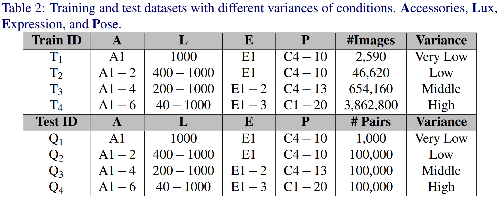

## Installation

### Setup with Conda
```bash
# create a new environment
conda create --name insightKface python=3.7 # or over
conda activate insightKface

#install the appropriate cuda version of pytorch(https://pytorch.org/)
#example:
conda install pytorch torchvision torchaudio cudatoolkit=11.1 -c pytorch -c conda-forge

# install requirements
pip install -r requirements.txt
```

## Data prepration

### K-FACE Database
K-FACE [AI-hub](https://aihub.or.kr/).

Detail configuration about K-FACE is provided in the paper below.

[K-FACE: A Large-Scale KIST Face Database in Consideration with
Unconstrained Environments](https://arxiv.org/abs/2103.02211)

K-FACE sample images


Structure of the K-FACE database


#### Detection & Alignment on K-FACE

```bash
"""
    ###################################################################

    K-Face : Korean Facial Image AI Dataset
    url    : http://www.aihub.or.kr/aidata/73

    Directory structure : High-ID-Accessories-Lux-Emotion
    ID example          : '19062421' ... '19101513' len 400
    Accessories example : 'S001', 'S002' .. 'S006'  len 6
    Lux example         : 'L1', 'L2' .. 'L30'       len 30
    Emotion example     : 'E01', 'E02', 'E03'       len 3
    
    ###################################################################
"""

# example
cd detection

python align_kfaces.py --ori_data_path '/data/FACE/KFACE/High' --detected_data_path 'kface_retina_align_112x112'
```
We referred to [https://github.com/biubug6/Pytorch_Retinaface](https://github.com/biubug6/Pytorch_Retinaface).

#### Training and test datasets on K-FACE 
We already create the T1-T4 YAML file and Q1-Q4 .txt file. See the [KFACE]() forder


### MS1M-RetinaFace
MS1M-RetinaFace download link: [The Lightweight Face Recognition Challenge & Workshop](https://github.com/deepinsight/insightface/tree/master/challenges/iccv19-lfr).

We referred to [https://github.com/deepinsight/insightface](https://github.com/deepinsight/insightface).
```bash
#Preprocess 'train.rec' and 'train.idx' to 'jpg'

# example
cd detection

python rec2image.py --include '/data/FACE/ms1m-retinaface-t1/' --output 'MS1M-RetinaFace'
```

## Inference

### Pretrained Model


```bash
cd face_analysis

# example
python test.py --name 'mixface_1e-22-m0.25' --wname 'best' --dataset 'kface'
```